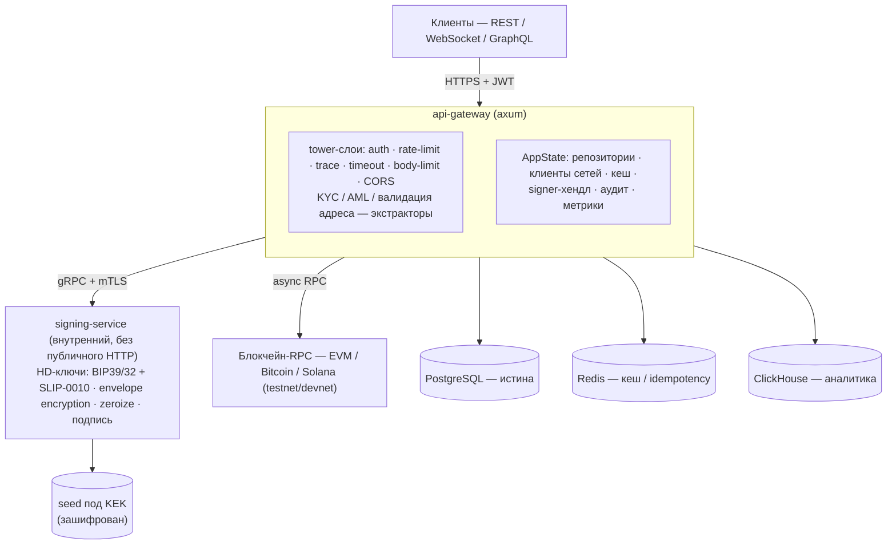
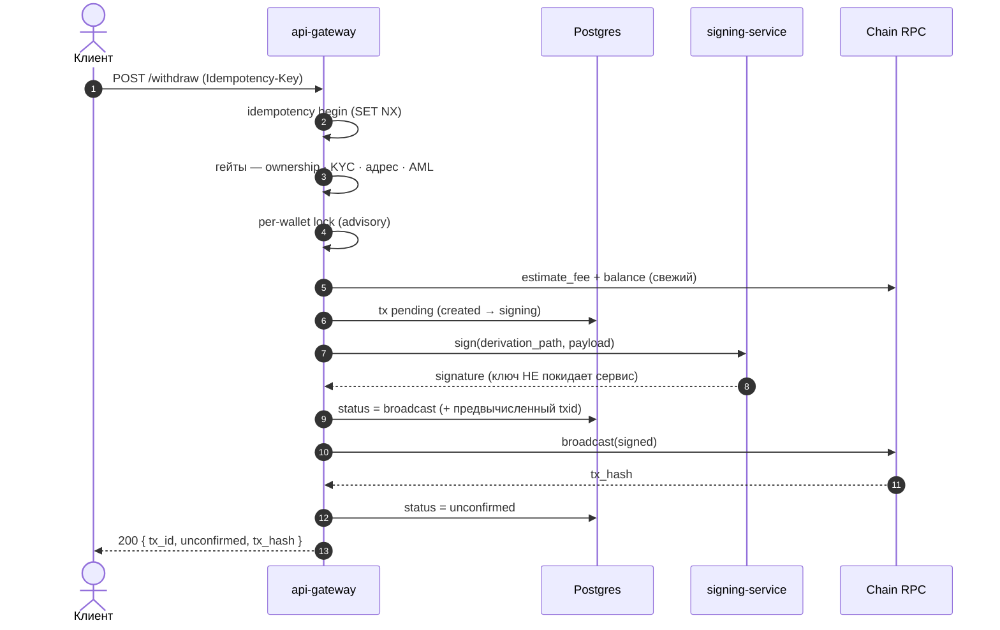
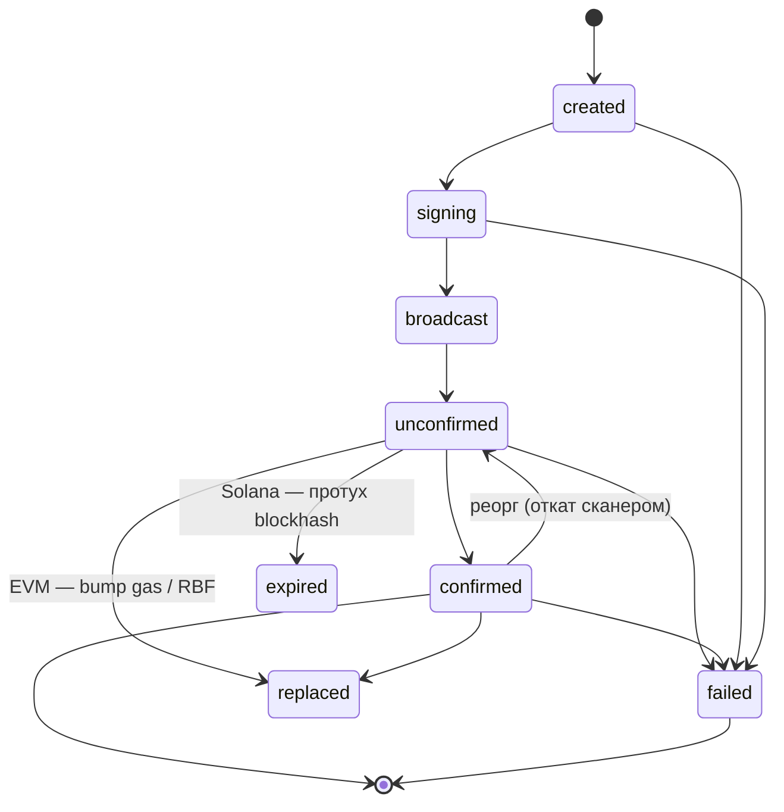
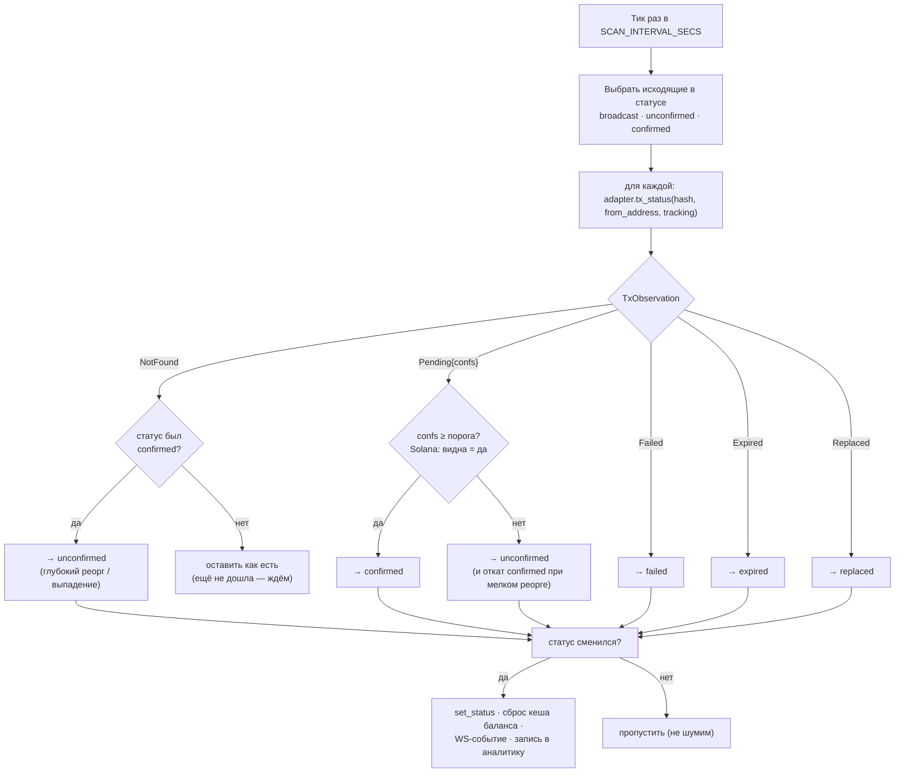
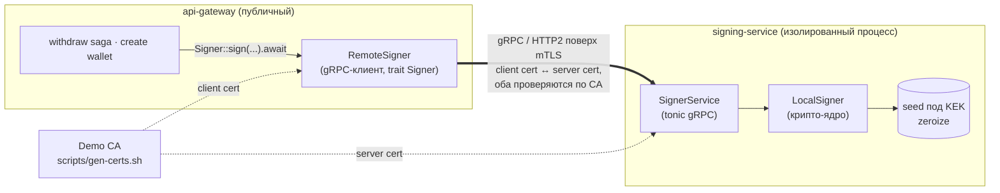
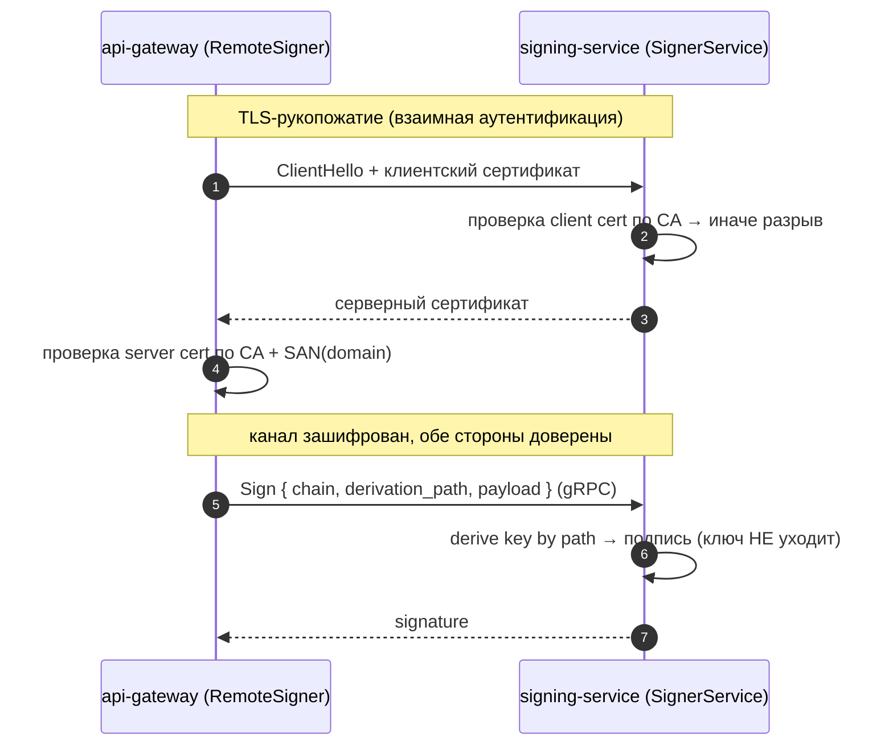
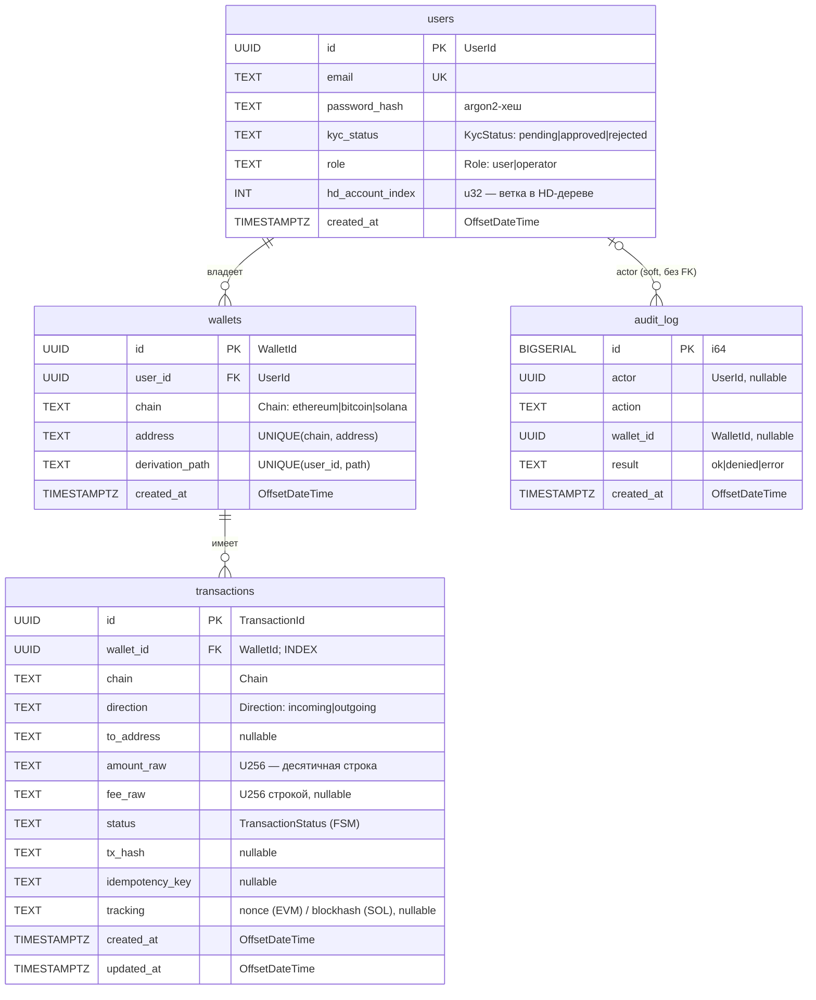

# VaultBridge

> Кастодиальный кошелёк на Rust сразу для нескольких блокчейнов: заводит адреса, хранит ключи в изоляции, собирает и подписывает транзакции, отдаёт балансы и историю через REST, GraphQL и WebSocket. Это портфолио-проект — на нём я показываю, как строю безопасные сервисы на боевом Rust-стеке.

[](https://github.com/MShubkin/VaultBridge/actions/workflows/ci.yml) · Rust 1.95 · axum 0.8 · Next.js 15

---

## Содержание

- [Что это](#что-это)
- [Архитектура](#архитектура)
- [Реконсиляция (block-scanner)](#реконсиляция-block-scanner)
- [Канал к signing-service (gRPC, mTLS)](#канал-к-signing-service-grpc-mtls)
- [Технологический стек](#технологический-стек)
- [Структура репозитория](#структура-репозитория)
- [Модель данных](#модель-данных)
- [Ключевые решения](#ключевые-решения)
- [Модель угроз и решения по безопасности](#модель-угроз-и-решения-по-безопасности)
- [Конфигурация](#конфигурация)
- [Сборка и запуск](#сборка-и-запуск)
- [Тестирование](#тестирование)
- [Деплой (Railway + Vercel)](#деплой-railway--vercel)
- [Обзор API](#обзор-api)
- [Границы и что дальше](#границы-и-что-дальше)

---

## Что это

VaultBridge — уменьшенная, но честная по архитектуре копия кастодиального сервиса. Всё крутится вокруг одной мысли — **изоляции ключей**: публичный шлюз никогда не держит приватные ключи, подписывает их отдельный сервис. Внутри живут три блокчейна с принципиально разной механикой транзакций (EVM — account-модель, Bitcoin — UTXO, Solana — эфемерный blockhash), и все три спрятаны за одним `trait BlockchainClient`.

---

## Архитектура



<sub>Граница gateway↔signing — единый `trait Signer`; в production это `RemoteSigner` поверх gRPC + взаимного TLS (детали ниже). Сам ключ живёт в `signing-service`, а не в gateway.</sub>

**Принцип изоляции.** Даже если публичный `api-gateway` скомпрометируют, ключи не утекут — их попросту нет в его памяти. Шлюз только авторизует операцию и просит `signing-service` подписать по пути деривации (`derivation_path`); приватный ключ к нему не возвращается. В этом и весь смысл кастодиальной модели.

**Сага вывода.** Вывод денег задевает сразу три системы — базу, `signing-service` и RPC блокчейна. Чтобы частичный сбой не обернулся потерей или задвоением средств, путь оформлен сагой: идемпотентность, лок на кошелёк, конечный автомат статусов и реконсиляция.



Машина состояний транзакции (`core-domain::TransactionStatus`):



Сага доводит транзакцию только до `unconfirmed` и возвращает ответ — финальный статус доводит фоновый block-scanner, см. [Реконсиляция](#реконсиляция-block-scanner).

---

## Реконсиляция (block-scanner)

Сага вывода не ждёт сеть: она доходит до `broadcast → unconfirmed`, отдаёт клиенту `tx_hash` и завершается. Дальше судьбу транзакции отслеживает фоновый воркор `scanner` — отдельная tokio-задача, которая тикает каждые `SCAN_INTERVAL_SECS` (по умолчанию 15с) и сверяет запись в БД с тем, что реально видно в сети.



**Как это работает по шагам.**

1. **Что опрашиваем.** Берём исходящие транзакции в «живых» статусах: `broadcast`, `unconfirmed` и — отдельно — `confirmed`. Подтверждённые пересматриваем намеренно: только так ловится реорг. Терминальные `failed`/`expired`/`replaced` не трогаем.
2. **Чем опрашиваем.** `adapter.tx_status(tx_hash, from_address, tracking)` возвращает `TxObservation` — обогащённое наблюдение, а не просто число подтверждений. `tracking` — это chain-specific токен, который сага сохранила рядом с транзакцией ещё при сборке: для EVM это `nonce`, для Solana — recent blockhash, для Bitcoin его нет.
3. **Как решаем.** Чистая функция `next_status(current, observation, confirmations_threshold)` отображает наблюдение в целевой статус — вся развилка FSM собрана в одном месте и тестируется без сети.
4. **Применяем только при изменении.** Если целевой статус совпал с текущим — пропускаем, чтобы не плодить лишние события. Иначе: `set_status` в БД → сброс кеша баланса → WS-событие владельцу → запись в аналитику.

**Что именно отдаёт каждый адаптер** (как `TxObservation` выводится из RPC):

| Сеть | NotFound | Pending | Failed | Expired | Replaced |
|------|----------|---------|--------|---------|----------|
| EVM (`alloy`) | нет квитанции, нет в мемпуле, nonce аккаунта ≤ нашего | есть квитанция (по глубине) или висит в мемпуле | `receipt.status == 0` (revert) | — | nonce аккаунта **прошёл** наш, а транзакции нет → слот занят другой |
| Bitcoin (Esplora) | `404` на `/tx/{id}/status` | в мемпуле или по высоте блока | — | — | — |
| Solana (RPC) | подписи нет **и** blockhash ещё валиден | `getSignatureStatuses` вернул статус | поле `err` непустое | подписи нет **и** `isBlockhashValid == false` | — |

**Реорг.** Подтверждение — не точка невозврата. Если ранее `confirmed`-запись просела по глубине ниже порога (`Pending{confs < N}`) или вовсе пропала из цепи (`NotFound`), сканер откатывает её в `unconfirmed` — она может переподтвердиться в новой ветке. Порог подтверждений берётся из `ChainConfig.confirmations` (у Solana его нет: финальность определяется commitment, поэтому сам факт «видна» уже считается достаточным).

**Краш-безопасность.** `tx_hash` пишется в БД **до** `broadcast` (детерминированный `txid` вычисляется из подписанных байт). Поэтому падение в момент отправки не оставляет «висячую» запись без хэша: сканер её увидит и досверит, а повторный `broadcast` идемпотентен.

**Надёжность воркера.** Логика разнесена на чистую `next_status` (тестируется как таблица истинности) и тонкий `reconcile_once`, который ходит в БД/сеть. Всё best-effort: ошибка RPC или БД логируется и не валит сервер — транзакция переедет на следующем тике. `MissedTickBehavior::Skip` не копит «долг» тиков, если проход затянулся.

**Известное упрощение.** Сейчас сканер перепроверяет все `confirmed`-записи на каждом тике. В проде это ограничивают глубиной блока (перепроверять только то, что в пределах `reorg_window` от вершины); для портфолио-объёма перепроверка всех приемлема и помечена в коде.

---

## Канал к signing-service (gRPC, mTLS)

Изоляция ключей держится не только на типах, но и на границе процессов. `signing-service` — отдельный gRPC-сервер на `tonic`: он хранит seed и наружу отдаёт **только адреса и подписи**. `api-gateway` ходит к нему через `RemoteSigner`, который реализует тот же `trait Signer`, что и локальный `LocalSigner`. Саге вывода поэтому всё равно, где физически лежит ключ.

В production gateway всегда ходит к удалённому `signing-service` (адрес — `SIGNER_GRPC_ENDPOINT`); `LocalSigner` остаётся внутри самого `signing-service` как крипто-ядро. Канал закрыт **взаимным TLS**: обе стороны показывают сертификаты от общего CA и проверяют друг друга. Без валидного клиентского сертификата до подписи не достучаться, а gateway не подключится к подменённому signer'у.



Рукопожатие и подпись по шагам (что проверяет интеграционный тест на loopback):



**Контракт** (`crates/proto/proto/signer.proto`): `service Signer { DeriveAddress, Sign }`. Через границу передаются только `chain` + `derivation_path` + `payload`; ответ — адрес или байты подписи (secp256k1 65 байт `r‖s‖v` или ed25519 64 байта). Строители TLS-конфигов вынесены в `proto::tls`, чтобы сервер, клиент и тест использовали один security-критичный код.

**Запуск двух процессов локально:**

```bash
./scripts/gen-certs.sh                 # → certs/{ca,server,client}.{crt,key}

# терминал 1 — signing-service с mTLS
SIGNER_BIND=0.0.0.0:50051 \
SIGNER_TLS_CERT=certs/server.crt SIGNER_TLS_KEY=certs/server.key \
SIGNER_TLS_CLIENT_CA=certs/ca.crt \
cargo run -p signing-service

# терминал 2 — gateway, ходит за подписью по mTLS
SIGNER_GRPC_ENDPOINT=https://localhost:50051 \
SIGNER_TLS_CLIENT_CERT=certs/client.crt SIGNER_TLS_CLIENT_KEY=certs/client.key \
SIGNER_TLS_CA=certs/ca.crt SIGNER_TLS_DOMAIN=localhost \
cargo run -p api-gateway
```

Все переменные канала (`SIGNER_GRPC_ENDPOINT`, `SIGNER_TLS_*`, `SIGNER_BIND`) сведены в раздел [Конфигурация](#конфигурация). Если `SIGNER_TLS_*` не заданы, канал остаётся plaintext — это допустимо только в доверённой приватной сети для локальной отладки. В проде сертификаты выдаёт внутренний CA / cert-manager / service-mesh (например SPIFFE), а не демо-скрипт.

---

## Технологический стек

| Слой | Технологии |
|------|-----------|
| HTTP/API | `axum` 0.8, `tower`, REST + GraphQL (`async-graphql`) + WebSocket |
| Контракт | OpenAPI (`utoipa`) → кодоген типов фронта |
| Async | `tokio` |
| Криптография | `bip39`/`bip32` (secp256k1), SLIP-0010 (ed25519), `k256`, `ed25519-dalek`, `aes-gcm` (envelope), `argon2`, `zeroize` |
| Сети | `alloy` (EVM), `rust-bitcoin` + Esplora (BTC), JSON-RPC + ручной wire (Solana, без `solana-sdk`) |
| gateway↔signing | `tonic`/`prost` (gRPC), взаимный TLS (`rustls` через tonic), контракт в крейте `proto` |
| Хранилище | PostgreSQL (`diesel`/`diesel-async`), Redis, ClickHouse |
| Наблюдаемость | `tracing`, Prometheus-метрики, `/healthz` + `/readyz` |
| Фронтенд | Next.js 15 + TypeScript, TanStack Query, Tailwind, деньги на `bigint` |
| Тесты | `cargo test` (unit + интеграционные, включая loopback-mTLS), Vitest (фронт) |

---

## Структура репозитория

```
VaultBridge/
├── crates/
│   ├── core-domain/      # Chain, KycStatus, Role, Amount<U256>, TransactionStatus (FSM), newtypes
│   ├── storage/          # репозитории/кеш/локи/аналитика: Postgres(diesel-async) · Redis · ClickHouse
│   ├── blockchain/       # trait BlockchainClient + ChainConfig (+ MockChain под фичой testing)
│   ├── chain-evm/        # alloy-адаптер (EIP-1559 build/sign/broadcast/confirmations)
│   ├── chain-btc/        # rust-bitcoin + Esplora (legacy-P2PKH UTXO spend)
│   ├── chain-sol/        # JSON-RPC + ручной wire (System transfer, ed25519)
│   ├── signing-service/  # HD-деривация, envelope encryption, multisig, подпись + gRPC-сервер (lib + bin)
│   ├── kyc-aml/          # KycProvider + AmlScreener (HTTP-провайдеры; моки — под фичой testing)
│   ├── proto/            # gRPC-контракт Signer (tonic/prost) + mTLS-строители (proto::tls)
│   └── api-gateway/      # axum-сервер: auth/RBAC, сага, GraphQL, ops, scanner, RemoteSigner
├── ui/                   # Next.js фронтенд (auth, кошельки, вывод, real-time, операторская консоль)
├── migrations/           # SQL-схема (применяется на старте, идемпотентно)
├── scripts/gen-certs.sh  # демо CA + server/client серты для mTLS (не коммитятся)
├── Dockerfile            # multi-stage сборка api-gateway
├── railway.json          # деплой-конфиг (Railway)
├── docker-compose.yml    # postgres / redis / clickhouse (локально)
└── .github/workflows/    # CI: fmt + clippy + test + build (backend), tsc/lint/test/build (ui)
```

---

## Модель данных

Схема в Postgres (`migrations/0001_init/up.sql`) — четыре таблицы. Денег и тем более ключей в открытом виде здесь нет: суммы хранятся строкой (`U256` не влезает в `numeric`-тип драйвера без потерь), а приватные ключи в БД не попадают вовсе — только публичные адреса и путь деривации.



Типы в диаграмме — это столбцы Postgres (DDL); в подписях — доменный Rust-тип, в который колонка маппится. Денежные поля и идентификаторы — namespace-новотипы (`UserId`/`WalletId`/`TransactionId` поверх `Uuid`, `U256` поверх `ruint`), enum'ы (`Chain`/`Role`/`KycStatus`/`Direction`/`TransactionStatus`) хранятся своим строковым кодом с `CHECK`-констрейнтом.

Что важно в схеме:

- **Никаких приватных ключей.** `wallets` хранит только адрес и `derivation_path`; сам ключ выводится из seed в `signing-service`. Утечка БД не даёт доступа к средствам.
- **Деньги — строки.** `amount_raw`/`fee_raw` — десятичное `U256` текстом; парсинг в целое происходит на границе приложения, без `float` по пути.
- **Уникальности под бизнес-правила.** `wallets`: `UNIQUE(chain, address)` (один адрес не заводится дважды) и `UNIQUE(user_id, derivation_path)` (детерминированный путь не коллизит). `users.email` уникален.
- **`transactions.tracking`** — chain-specific токен (EVM nonce / Solana blockhash), по которому реконсилятор отличает «заменена»/«истекла» от «ещё не дошла». Индекс по `wallet_id` ускоряет историю кошелька.
- **`audit_log` — append-only.** Связь с `users.actor` логическая, без жёсткого FK (журнал переживает удаление субъектов и пишется даже для отказов). В проде на таблицу вешают `REVOKE UPDATE, DELETE`.

---

## Ключевые решения

Короткая выжимка «почему именно так» — то, что стоит за кодом.

- **Деньги — целое `U256` (в БД `NUMERIC(78,0)`/TEXT, на фронте `bigint`), без float.** В финтехе ошибка округления — это потерянные средства. Минимальные единицы сети (wei / satoshi / lamports) и checked-арифметика убирают класс багов с плавающей точкой сразу на обеих границах — ввода и хранения.
- **Каждый бэкенд спрятан за трейтом, реализация выбирается по env.** `BlockchainClient`, `Signer`, репозитории, кеш, локи, аналитика — всё за трейт-объектами. Сага и хендлеры не знают, Postgres это или мок, EVM или Solana. Смена хранилища или добавление сети не трогает бизнес-логику.
- **`Signer` async, и в проде он удалённый.** Подпись могла бы быть обычным вызовом функции, но async-трейт позволяет той же абстракцией закрыть и сетевой `RemoteSigner` поверх gRPC + mTLS. Так граница изоляции ключей становится сетевой, а сагу переписывать не пришлось.
- **Вывод оформлен сагой, а не одной транзакцией.** Операция размазана по БД, signing-service и RPC — единого `COMMIT` на всех троих не существует. Идемпотентность, per-wallet lock, конечный автомат статусов и реконсиляция дают «довести до конца или безопасно остановиться» — без потерь и задвоений.
- **`txid` вычисляется до broadcast.** Для всех трёх сетей идентификатор однозначно выводится из подписанных байт, поэтому хэш пишется в БД ещё до отправки. Падение в момент broadcast не оставляет запись без хэша — реконсилятор её досверит, а повторная отправка идемпотентна.
- **Production-only, тест-двойники за фичей `testing`.** Никаких тихих in-memory/mock-фолбэков в боевом бинаре: нет обязательной переменной — сервис не стартует (fail-fast). Двойники компилируются только в тестах, поэтому прод чистый, а тест-сьют остаётся зелёным.
- **Per-chain различия — это данные (`ChainConfig`), а не `match` по `Chain`.** decimals, порог подтверждений, dust-лимит лежат в конфиге; ветвлений по сети в логике нет, добавить сеть — значит добавить адаптер и строку конфига.

---

## Модель угроз и решения по безопасности

| Угроза | Контрмера |
|--------|-----------|
| Компрометация публичного API-слоя | Приватных ключей в памяти gateway нет; подпись — только через изолированный `signing-service` |
| Несанкционированный доступ к signer / MITM канала | Взаимный TLS gateway↔signing: сервер требует клиентский сертификат, клиент проверяет сервер по CA; без валидного серта подпись недоступна |
| Кража БД | В БД gateway приватных ключей нет вообще — только публичные адреса. Seed живёт в памяти `signing-service`; при хранении на диске запечатывается envelope-шифрованием (AES-256-GCM, DEK под KEK, KEK вне БД) |
| Утечка ключа из памяти | `zeroize`/`Zeroizing`, минимальное время жизни расшифрованного материала |
| Доступ к чужому кошельку (IDOR) | Проверка владения в репозитории, экстрактор `OwnedWallet`, `404` вместо `403` |
| Превышение полномочий оператора | `operator` — только чтение/разбор; ни ключей, ни инициации вывода; `RequireOperator` + аудит |
| Двойной вывод (replay) | `Idempotency-Key` (неймспейс по user) + идемпотентный broadcast |
| Гонка двух выводов с одного кошелька | Per-wallet advisory-lock (Postgres): операции сериализуются — нет конфликта nonce/UTXO |
| Потеря/задвоение при частичном сбое | Детерминированный `txid` пишется в БД **до** broadcast + идемпотентный broadcast + фоновая реконсиляция по `tx_hash` |
| Транзакция «висит» в неопределённости | Реконсилятор по сохранённым nonce/blockhash переводит её в `replaced`/`expired`/`failed`, а не оставляет вечно `unconfirmed` |
| Реорг отменяет подтверждённую транзакцию | Сканер перепроверяет `confirmed` и откатывает в `unconfirmed` при просадке глубины или выпадении из цепи |
| Вывод на адрес чужой сети / битый | Per-chain валидация формата и network до подписи |
| Списание больше доступного | Проверка `spendable ≥ amount + fee` (свежий баланс, мимо кеша), dust-limit, потолок комиссии |
| Вывод на запрещённый адрес | AML-скрининг (внешний HTTP) до бизнес-логики; провайдер недоступен → fail-closed (адрес считается запрещённым) |
| Операции без верификации | KYC-гейт перед выводом (внешний HTTP-провайдер); провайдер недоступен → fail-closed (статус не `approved`) |
| Устаревший баланс | Кеш с TTL + инвалидация при изменении состояния кошелька |
| Отсутствие следа операций | Append-only аудит-лог (успех и отказы) |

Денежные величины — целочисленные минимальные единицы (`U256`, в БД `NUMERIC(78,0)`), никогда `f64`/`Number`; на фронте — `bigint`. Точность стережётся на обеих границах (ввод и хранение).

---

## Конфигурация

Всё задаётся переменными окружения (пример — в `.env.example`). Обязательные относятся к `api-gateway`: без любой из них он не стартует (fail-fast). `signing-service` запускается отдельным процессом со своим набором.

| Переменная | Сервис | Обяз. | Дефолт | Назначение |
|------------|--------|:-----:|--------|-----------|
| `JWT_SECRET` | gateway | да | — | секрет подписи JWT |
| `DATABASE_URL` | gateway | да | — | Postgres (diesel-async) |
| `REDIS_URL` | gateway | да | — | Redis: кеш балансов + идемпотентность |
| `CLICKHOUSE_URL` | gateway | да | — | ClickHouse (HTTP) для аналитики |
| `EVM_RPC_URL` | gateway | да | — | JSON-RPC EVM-сети |
| `KYC_PROVIDER_URL` | gateway | да | — | внешний KYC-провайдер (HTTP) |
| `AML_SCREENING_URL` | gateway | да | — | внешний AML-скрининг (HTTP) |
| `SIGNER_GRPC_ENDPOINT` | gateway | да | — | адрес `signing-service` |
| `BTC_ESPLORA_URL` | gateway | нет | — | Esplora API; без неё Bitcoin отключён |
| `SOLANA_RPC_URL` | gateway | нет | — | RPC Solana; без неё Solana отключена |
| `SIGNER_TLS_CLIENT_CERT` | gateway | нет¹ | — | клиентский сертификат (mTLS) |
| `SIGNER_TLS_CLIENT_KEY` | gateway | нет¹ | — | клиентский ключ (mTLS) |
| `SIGNER_TLS_CA` | gateway | нет¹ | — | CA для проверки сервера |
| `SIGNER_TLS_DOMAIN` | gateway | нет¹ | — | ожидаемый SAN сервера |
| `SCAN_INTERVAL_SECS` | gateway | нет | `15` | период реконсилятора, сек |
| `PORT` | gateway | нет | `8080` | порт HTTP |
| `CORS_ORIGIN` | gateway | нет | permissive | разрешённый origin фронта |
| `SIGNER_MNEMONIC` | signing | нет² | dev-мнемоника | seed (в проде — из KMS/secret) |
| `SIGNER_BIND` | signing | нет | `0.0.0.0:50051` | адрес прослушивания gRPC |
| `SIGNER_TLS_CERT` | signing | нет³ | — | серверный сертификат |
| `SIGNER_TLS_KEY` | signing | нет³ | — | серверный ключ |
| `SIGNER_TLS_CLIENT_CA` | signing | нет³ | — | CA для проверки клиента (включает mTLS) |
| `RUST_LOG` | оба | нет | `info` | уровень логов (`tracing` `EnvFilter`) |

¹ Клиентский mTLS включается, только если заданы все четыре `SIGNER_TLS_*`; иначе канал к signer остаётся plaintext (допустимо лишь в доверённой сети).
² Dev-дефолт — известная тест-мнемоника; в production обязателен реальный секрет из KMS/secret-хранилища.
³ Серверный mTLS включается, только если заданы все три; иначе `signing-service` слушает plaintext.

---

## Сборка и запуск

**Требования:** Rust 1.95+, Node 22+, Docker (для БД).

```bash
# Инфраструктура (Postgres/Redis/ClickHouse)
docker compose up -d

# Бэкенд: проверки и запуск
cargo fmt --all --check
cargo clippy --workspace --all-targets -- -D warnings
cargo test --workspace
# Запуск (требует заданных DATABASE_URL/REDIS_URL/CLICKHOUSE_URL/EVM_RPC_URL/
# SIGNER_GRPC_ENDPOINT/KYC_PROVIDER_URL/AML_SCREENING_URL — см. .env.example).
# Сначала поднимается signing-service (отдельный процесс), затем gateway.
cargo run -p api-gateway          # слушает :8080

# OpenAPI-спека (для кодогена фронта) — env не требует
cargo run -p api-gateway -- openapi > ui/openapi.json

# Фронтенд
cd ui && npm install
npm run typecheck && npm run lint && npm run test && npm run build
npm run dev                       # http://localhost:3000
```

Сервис production-only: без обязательных переменных он не стартует. Пользователей и кошельки заводят через API (`POST /v1/users`, `POST /v1/wallets`) — встроенных демо-аккаунтов нет.

---

## Тестирование

Около 90 тестов, все детерминированные и без сети — гоняются одной командой:

```bash
cargo test --workspace
```

Что покрыто:

- **Эталонные векторы** — HD-деривация (BIP39/BIP32, SLIP-0010), адреса и подписи сверяются с известными значениями.
- **Структурная сборка транзакций** — EVM EIP-1559 sighash, Bitcoin legacy scriptSig (pubkey восстанавливается из recoverable-подписи), Solana wire-формат и compact-u16 по известным векторам.
- **Сага и сканер на `MockChain` + in-memory** — идемпотентность вывода, per-wallet lock, dust/fee-cap, и весь FSM реконсилятора: confirm по порогу, откат при реорге, переходы в failed/expired/replaced.
- **Реальный mTLS** — интеграционный тест поднимает `signing-service` с взаимным TLS на loopback (сертификаты генерит `rcgen`), проверяет, что подпись по каналу совпадает с локальной и что клиент без сертификата отклоняется.
- **Фронт** — Vitest: деньги на `bigint` (парсинг/формат/переполнение), чистые хелперы операторской консоли.

Тест-двойники (in-memory репозитории/кеш/локи/аналитика, `MockChain`, моки KYC/AML) спрятаны за cargo-фичу `testing` и подтягиваются только dev-зависимостями — в production-бинаре их нет.

**Чего эти тесты не делают** (нужны живые сервисы/сети, проверяется при `docker compose up` и заданных env): реальный broadcast в testnet/devnet, обращения к Postgres/Redis/ClickHouse/RPC, детект `Replaced`/`Expired` (требует живого RPC).

Quality gate в CI: `cargo fmt --all --check` + `cargo clippy --workspace --all-targets -- -D warnings` + `cargo test --workspace`.

---

## Деплой (Railway + Vercel)

Топология — два сервиса: публичный `api-gateway` и изолированный `signing-service`. Gateway требует Postgres, Redis, ClickHouse, RPC сетей, KYC/AML-провайдеры и адрес signing-service — все обязательные переменные перечислены в `.env.example`.

**Backend на Railway:**
1. New Project → Deploy from Repo (Railway подхватит `Dockerfile`/`railway.json`).
2. Add Postgres + Redis (плагины) — `DATABASE_URL`/`REDIS_URL` пробросятся в сервис; ClickHouse и RPC сетей задаются вручную.
3. Разверните `signing-service` отдельным сервисом и пропишите gateway `SIGNER_GRPC_ENDPOINT` + клиентские `SIGNER_TLS_*` (см. [Канал к signing-service](#канал-к-signing-service-grpc-mtls)). Seed живёт только в нём.
4. Остальные переменные: `JWT_SECRET`, `KYC_PROVIDER_URL`, `AML_SCREENING_URL`, `CORS_ORIGIN`. См. `.env.example`.
5. Схема применяется на старте (`run_migrations`, идемпотентно). Healthcheck — `/healthz`.

**Frontend на Vercel:**
1. Import `ui/` как Next.js проект.
2. `NEXT_PUBLIC_API_BASE_URL` = URL Railway-сервиса; explorer-URL из `.env.example`.

**TLS к managed-БД:** Redis по `rediss://` поддержан (rustls). Postgres на Railway — по приватной сети без TLS; для Neon (`sslmode=require`) нужно включить TLS у `diesel-async` (`tokio-postgres-rustls`) — оставлено как шаг под конкретного провайдера.

**Альтернатива (free-навсегда):** Fly.io (api + signing-service) + Neon (PG) + Upstash (Redis) — добавить `fly.toml` поверх того же `Dockerfile`.

---

## Обзор API

| Метод | Путь | Назначение |
|-------|------|-----------|
| `POST` | `/v1/auth/login` | выпуск JWT (claims `sub`/`role`/`kid`) |
| `POST` | `/v1/users` | создать пользователя (KYC-онбординг) |
| `GET` | `/v1/wallets` · `POST /v1/wallets` | список / создание кошелька (HD-адрес) |
| `POST` | `/v1/wallets/{id}/withdraw/quote` | оценка комиссии/итога без побочек |
| `POST` | `/v1/wallets/{id}/withdraw` | вывод (сага; `Idempotency-Key`) |
| `POST` | `/v1/graphql` | агрегированный портфель по сетям |
| `GET` | `/v1/ws` | real-time события статусов (JWT через `Sec-WebSocket-Protocol`) |
| `GET` | `/v1/ops/audit` · `/v1/ops/withdrawals` | операторский доступ (`operator`) |
| `GET` | `/healthz` · `/readyz` · `/metrics` | liveness / readiness / Prometheus |

Полный контракт — в `/api-docs/openapi.json`.

---

## Границы и что дальше

Честно о том, что осознанно осталось за рамками — это портфолио-проект, а не боевой кастодиан.

**Осознанные границы:**

- **Live-broadcast не прогонялся против реальных сетей** — нет профинансированных testnet/devnet-аккаунтов. Консенсус-кодирование (EVM/BTC/Solana) проверено компиляцией и структурными тестами, но не живой отправкой.
- **Реконсилятор перепроверяет все `confirmed`-записи каждый тик.** В проде это ограничивают глубиной блока (только в пределах `reorg_window` от вершины) — пометка есть в коде.
- **`Replaced` (EVM) и `Expired` (Solana) детектируются только против живого RPC** — в офлайн-тестах не воспроизводятся.
- **KYC/AML — HTTP-клиенты к внешним сервисам (fail-closed), но реального провайдера за ними нет.** Контракт запроса/ответа задан по умолчанию и подгоняется под конкретного вендора.
- **`signing-service` — один инстанс.** HA/реплики, ротация KEK по `key_version` и выдача сертификатов через внутренний CA / SPIFFE — вне рамок демо.
- **Авторизация по `derivation_path` на стороне signer спроектирована, но не реализована** — сейчас граница держится на mTLS.

**Что дальше:**

- Ограничить перепроверку `confirmed` глубиной блока (хранить depth, сверять с `reorg_window`).
- Проверка `derivation_path` в `signing-service`: путь принадлежит известному дереву, `chain` совпадает.
- HA для `signing-service` + ротация KEK; реальные провайдеры KYC/AML.
- Бонусы: MPC threshold-ECDSA, SoftHSM2 через PKCS#11 (ключ не покидает HSM).
- E2E через UI (Playwright) и сквозной прогон в testnet/devnet.
